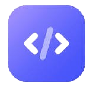

# Blitz AI Code Tool

 

## Overview

**Blitz** is a chat application that uses OpenAI's language model to assist users with coding-related questions. Users can input their code and specify what they need help with, receiving fast and relevant responses from the AI. The application features an easy-to-use interface and maintains a chat history for better user experience.

## Features

- **Interactive Chat Interface**: A user-friendly layout that allows for easy interaction.
- **Code Submission**: Users can enter their code segments and specify the help needed.
- **AI Assistance**: Powered by OpenAI's API, the app generates helpful responses based on user input.
- **Focused Messages**: Users can click on any response to focus and view it in detail.
- **Error Handling**: Displays relevant error messages for improved usability.
- **Reactive Design**: Works well on both mobile devices and desktop browsers.

## Technologies Used

- Python
- Flask
- OpenAI API
- HTML
- CSS
- JavaScript
- Bootstrap

## Installation

To set up the project locally, follow these steps:

1. **Clone the repository**:
   ```bash
   git clone https://github.com/username/blitz-chat-app.git
   cd blitz-chat-app
2. Install the Dependencies: Make sure you have Pythonand pip installed
   Run
   ```bash
   pip install -r requirements.txt
   ```
3. Next create a .env file in the project root:
   ```bash
   OPENAI_API_KEY = your-open-ai-project-key
   ```
4. Run the Flask App
   ```bash
   python app.py
   ```
5. Open your browser and enter http://127.0.0.1:5000 to see the app.

## How to use

1. Enter Your Code segment into the Enter Code Here text field.
2. Specify what you need help with in the Enter Help Needed Here text field.
3. Click the Ask button to ask you question.
4. Watch the AI respond in real-time.
5. Click on any response to view it in detail within the Focused Message field.

## API Reference
This app uses OpenAI API to generate responses based on user input.

#Contribution
I plan to contribute to this further with time, however you may feel free to make contributions and suggestions. you are welcome to create a pull request.

